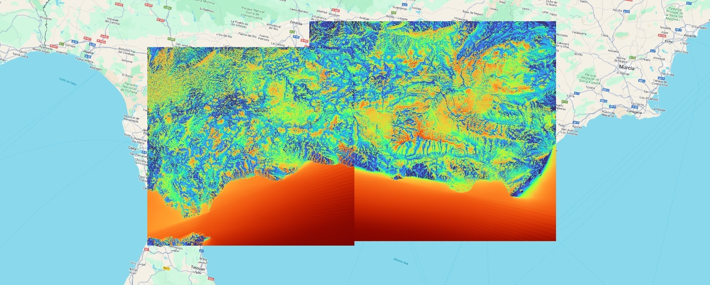

# Project: Total Viewshed Calculation for Spanish National Parks

This project aims to calculate the Total Viewshed within the socio-economic influence area of the major national parks in Spain. It focuses on determining the Total Viewshed, emphasizing their significance in landscape analysis and planning.

## Overview

 Total Viewshed are essential for understanding the visual impact of natural landscapes, particularly within the context of national parks. By identifying these sheds, stakeholders can make informed decisions regarding land use, conservation efforts, and tourism development.

### Project Images

*Map showing the Spanish national parks, their influence area, a 60km buffer, and the bounding boxes of the buffers.*

* Total Viewshed of the bounding boxes in Andalucia, calculated with a resolution of 30m.*

### QGIS Project

To explore the data and results further, you can access the QGIS project [here](link_to_qgis_project).

## Scripts and Tools

The project utilizes several Python scripts for buffer and bounding box generation:

- `main.py`
- `ppnn2024a.py`
- `ppnn2024b.py`
- `ppnn2024c.py`

These scripts are instrumental in preprocessing the data and preparing it for Total Viewshed calculations.

## GDAL Tool Development

A custom tool, `gdal_tviewshed`, has been developed from a branch of GDAL, particularly from the existing `gdal_viewshed`. This tool enhances the capabilities of GDAL for  Total Viewshed analysis. You can find the GitHub repository for this branch [here](link_to_gdal_tviewshed).

Additionally, for Windows users, a compiled version (`gdal_tviewshed.exe`) is available for easy integration into existing workflows.

## Computational Methods

The  Total Viewshed calculations are performed using the skewEngine algorithm, available at [this GitHub repository](https://github.com/luisfromero/skewEngine). These calculations are optimized for performance, leveraging the power of a RTX4080 GPU with C++ and OpenCL.

---

This project serves as a valuable resource for environmentalists, policymakers, and researchers interested in understanding and preserving the visual integrity of Spain's national parks. For any inquiries or collaborations, feel free to contact the project maintainers.
