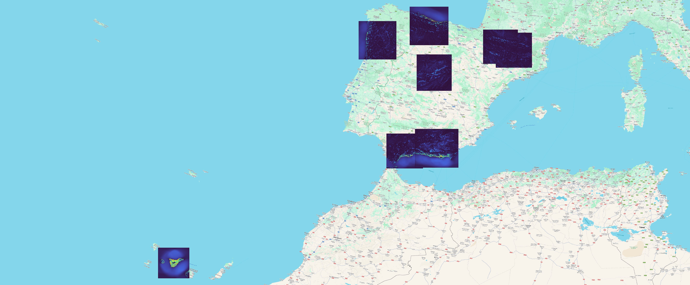
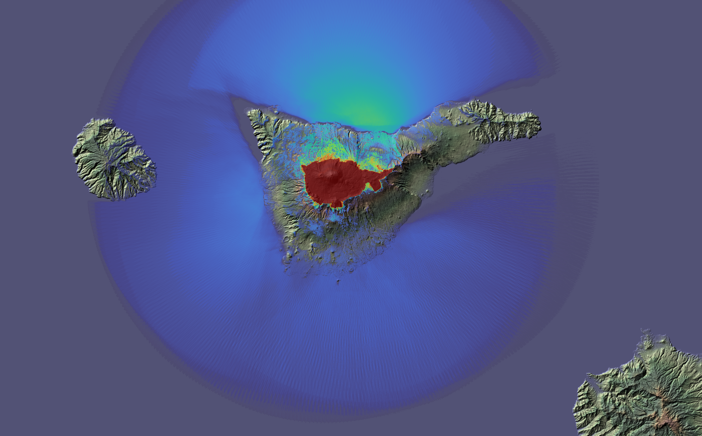

# Total Viewshed Calculation for Spanish National Parks

This project aims to calculate the Total Viewshed within the socio-economic influence area of the major national parks in Spain. It focuses on determining the Total Viewshed, emphasizing their significance in landscape analysis and planning.

## Overview


 Total Viewshed are essential for understanding the visual impact of natural landscapes, particularly within the context of national parks. By identifying these sheds, stakeholders can make informed decisions regarding land use, conservation efforts, and tourism development.


*Map showing the Spanish national parks, their influence area, a 60km buffer, and the bounding boxes of the buffers.*

## GDAL_TViewshed

A crucial aspect in studying the total visual basin of Spain's national parks is the development of a suitable computer tool that is both versatile and efficient. Therefore, inspired by the fantastic gdal_viewshed tool by Tamas Szekeres [cite], we have created GDAL_TVS (TotalViewshed). Essentially, this tool utilizes the efficient skewEngine algorithm [cite] to compute the total visual basin of an elevation model.

However, during the adaptation of the algorithm to GDAL, as well as during the analysis of the state-of-the-art in the visibility field, we discovered the possibility of adapting the tool to meet a growing demand in GIS, especially related to surveillance or observation paths, and solar radiation calculations.

The result is GDAL_TVS: a tool that, from a raster elevation model, produces three types of output rasters:

1. **TOTAL:** In this mode, the raster calculates the total visual basin of the terrain, measured in visible hectares from each point of the input raster, and stored as a geoTIFF raster layer of type float32.

2. **MULTIPLE:** In this mode, the application computes the visual basin observed from a subset of points of the input raster, which can be a polygon or a path, for example. The result is a raster layer with a mask, similar to what gdal_viewshed produces. But unlike gdal_viewshed, the mask is not boolean but a float indicating if a destination point is visible from a greater or lesser number of observation points.

3. **RADIATION:** The third mode is intended to generate a raster that can be useful in a tool for calculating solar radiation. In this case, GDAL_TVS produces 3 layers of information (362 bands of byte size) in which, for each point, it stores:

   - 1 head value
   - 1 tilt value
   - 360 elevation of the horizon at each azimuth

The developed tool can utilize available CPU cores (with OpenMP) but is incredibly fast on GPUs (using OpenCL). For example, calculations on raster dimensions of 5000x5000 are processed in just a few seconds.

## GDAL Tool Development

A custom tool, `gdal_tviewshed`, has been developed from a branch of GDAL, particularly from the existing `gdal_viewshed`. This tool enhances the capabilities of GDAL for  Total Viewshed analysis. You can find the GitHub repository for this branch [here](link_to_gdal_tviewshed).

Additionally, for Windows users, a compiled version [(`gdal_tviewshed.exe`)](sources/gdal_tviewshed.exe) is available for easy integration into existing workflows.

## Proposed changes to GDAL

### Three minor changes to existing files:

* **gdal\alg\CMakeLists.txt** (a new line, including tviewshed.cpp)
* **gdal\alg\gdal_alg.h** (two definitions: GDALTViewshedOutputType and GDALTViewshedGenerate)
*  **gdal\apps\CMakeLists.txt**
     * add_executable(gdal_tviewshed gdal_tviewshed.cpp)
     * gdal_tviewshed (APPS_TARGETS)

### 2-4 new files (depending on whether the headers are included or not)

* [apps\gdal_tviewshed.cpp](sources/gdal_tviewshed.cpp)
* [gdal\alg\tviewshed.cpp](sources/tviewshed.cpp)
* [gdal\alg\tvs\skewEngine.h](sources/skewEngine.h)
* [gdal\alg\tvs\tviewshed.h](sources/tviewshed.h)


¿OpenMP?

### Project Images


* Total Viewshed of the bounding boxes around Spain National Parks, calculated with a resolution of 30m.*


* Total Viewshed of the bounding boxes in two National Parks in Andalucia ( (Sierra Nevada, on the right, and Sierra de las Nieves, on the left), calculated with a resolution of 30m, and excluding Earth's curvature.*

## Multiple viewshed (viewshed for many points)

Two examples for multiple viewshed:

* A route from a line shapefile (from _Posiciones del Veleta_ to _Mulhacén_)
* A surface from a polygon shapefile (_Teide National Park_)


* This image shows the viewshed visible from any point in a route of about 20km, with a resolution of 30m, so it is the sum of around 512 single viewsheds. The calculation was carried out with an NVidia GPU in 20 seconds.*



* This image shows the viewshed visible from any point in the Teide National Park (189km2), with a resolution of 30m, so it is the sum of around 209000 single viewsheds. The calculation was carried out with an NVidia GPU in 18 seconds.*


### Building a two-band raster (heights+mask) for multiple viewshed

```sh
rem borramos el raster destino y los metadatos de qgis para evitar confusión al viasualizar max min
del d:\datos\input\rutaMulhacen.tif.aux.xml
del d:\datos\input\rutaMulhacen.tif
rem copiamos el raster sobre el que vamos a trabajar (extension resolucion y crs) pero con valor 0
c:\OSGeo4W\bin\gdal_create.exe -burn 0 -if d:\datos\input\bak\SierraNevada.tif d:\datos\input\rutaMulhacen.tif
rem quemamos el shape con valor 1
C:\OSGeo4W\bin\gdal_rasterize.exe -burn 1  -l rutaMulhacen d:/datos/input/rutaMulhacen.shp d:/datos/input/rutaMulhacen.tif
rem hacemos el merge en dos pasos (primero, creamos un rater virtual de dos bandas con dos tif)
C:\OSGeo4W\bin\gdalbuildvrt.exe d:\datos\input\bak\rutaMulhacen.vrt -separate d:\datos\input\bak\SierraNevada.tif d:\datos\input\rutaMulhacen.tif
rem convertirmos el rater virtual en un raster con dos bandas
C:\OSGeo4W\bin\gdal_translate  d:\datos\input\bak\rutaMulhacen.vrt   d:\datos\input\rutaMulhacen_merge.tif
```

## ToDo: Radiation raster

* Calcular head a tilt
* Sustituir skewoutput=cv por maxangle_F y maxangle_B
* Construir raster de 362 capas


### QGIS Project

To explore the data and results further, you can access the QGIS project [here](link_to_qgis_project).

## Scripts and Tools

The project utilizes several Python scripts for buffer and bounding box generation:

- [main.py](scripts/main.py)
- [ppnn2024a.py](scripts/ppnn2024a.py)
- [ppnn2024b.py](scripts/ppnn2024b.py)
- [ppnn2024c.py](scripts/ppnn2024c.py)

These scripts, to be used, for example, in the QGIS python console, are instrumental in preprocessing the data and preparing it for Total Viewshed calculations.

```
-maskPOVs 
-om MASK 
-oz 1.5 
-md 60000  
D:\datos\input\bak\Picos.tif D:/datos/output/Picos.tif
```

```sh
d:\onedrive\proyectos\gdal\cmake-build-release\apps\Release\gdal_tviewshed.exe  -oz 1.5 -md 60000  D:\datos\input\bak\Picos.tif        D:\onedrive\proyectos\ppnn\resultados\Picos.tif
d:\onedrive\proyectos\gdal\cmake-build-release\apps\Release\gdal_tviewshed.exe  -oz 1.5 -md 60000  D:\datos\input\bak\Ordesa.tif       D:\onedrive\proyectos\ppnn\resultados\Ordesa.tif
d:\onedrive\proyectos\gdal\cmake-build-release\apps\Release\gdal_tviewshed.exe  -oz 1.5 -md 60000  D:\datos\input\bak\AiguesTortes.tif D:\onedrive\proyectos\ppnn\resultados\AiguesTortes.tif
d:\onedrive\proyectos\gdal\cmake-build-release\apps\Release\gdal_tviewshed.exe  -oz 1.5 -md 60000  D:\datos\input\bak\SierraNevada.tif D:\onedrive\proyectos\ppnn\resultados\SierraNevada.tif
d:\onedrive\proyectos\gdal\cmake-build-release\apps\Release\gdal_tviewshed.exe  -oz 1.5 -md 60000  D:\datos\input\bak\SierraNieves.tif D:\onedrive\proyectos\ppnn\resultados\SierraNieves.tif
d:\onedrive\proyectos\gdal\cmake-build-release\apps\Release\gdal_tviewshed.exe  -oz 1.5 -md 60000  D:\datos\input\bak\Teide.tif        D:\onedrive\proyectos\ppnn\resultados\Teide.tif
d:\onedrive\proyectos\gdal\cmake-build-release\apps\Release\gdal_tviewshed.exe  -oz 1.5 -md 60000  D:\datos\input\bak\Peneda.tif       D:\onedrive\proyectos\ppnn\resultados\Peneda.tif
d:\onedrive\proyectos\gdal\cmake-build-release\apps\Release\gdal_tviewshed.exe  -oz 1.5 -md 60000  D:\datos\input\bak\Guadarrama.tif   D:\onedrive\proyectos\ppnn\resultados\Guadarrama.tif
```


## Computational Methods

The  Total Viewshed calculations are performed using the skewEngine algorithm, available at [this GitHub repository](https://github.com/luisfromero/skewEngine). These calculations are optimized for performance, leveraging the power of a RTX4080 GPU with C++ and OpenCL.


---


This project serves as a valuable resource for environmentalists, policymakers, and researchers interested in understanding and preserving the visual integrity of Spain's national parks. For any inquiries or collaborations, feel free to contact the project maintainers.
